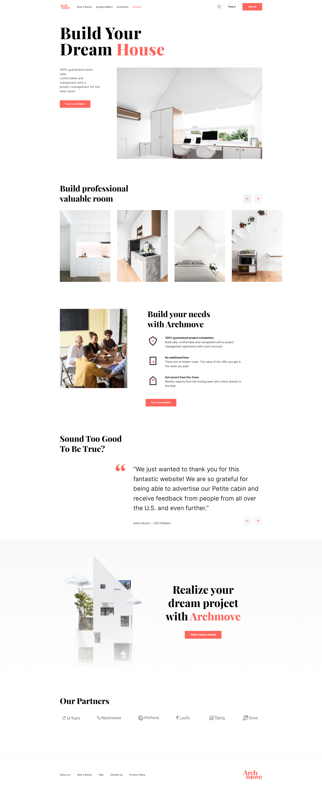

# Archmove

## Welcome! 👋

Thank you for looking here :)

I present my first project after returning to frontend after a year break.
I treated this project as if it was going out to the client. I tried to work on even the smallest details to make the site polished to the highest level. For the creation of this site were used "basic" languages such as HTML, SCSS and JS.
To make the carousel I used the [SwiperJS](https://swiperjs.com/) slider.

I modeled after a project available for free which was designed in figma ;)
[Uikitfree](https://uikitfree.com/free-architecture-responsive-website-design-figma-template/)

I don't stop and fly on and you sit back and relax with a coffee ;) 
LIVE: https://xbuzax.github.io/Archmove/